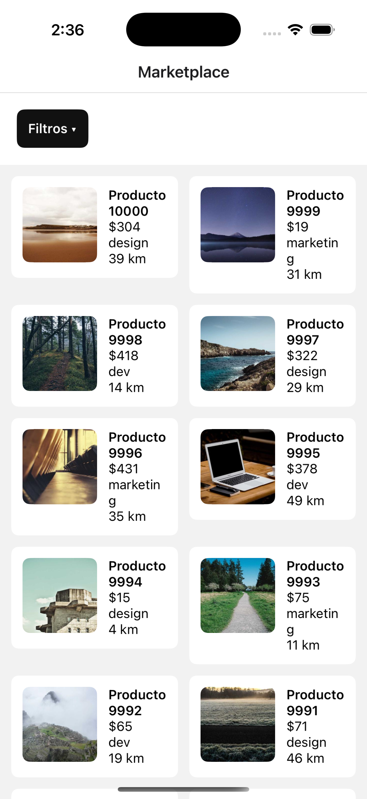
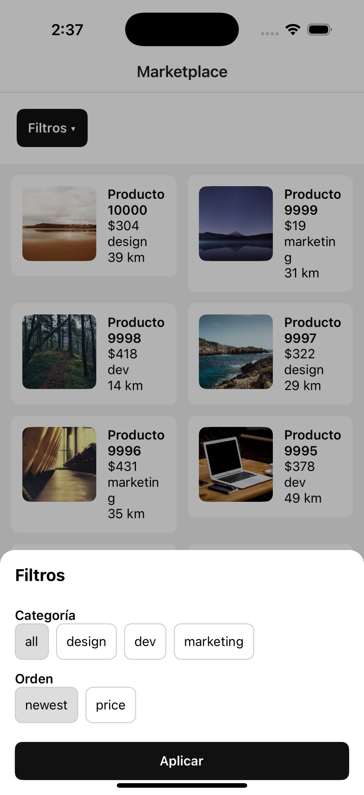
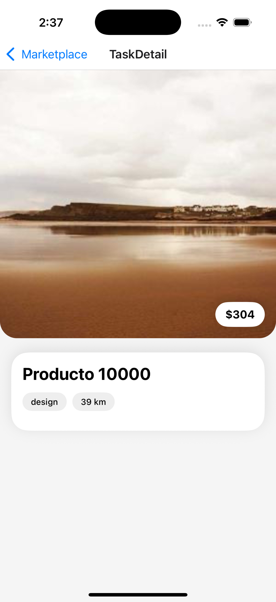

# Challenge Zubale - Infinite Marketplace (Performance)

📱 Aplicación mobile desarrollada con **Expo / React Native** como parte de un challenge técnico enfocado en **performance y optimización de listas grandes**.

El objetivo del proyecto es demostrar:
- Render eficiente de **listas con miles de items (10.000+)**
- **Scroll fluido** sin bloqueos del JS thread
- **Filtros y ordenamientos pesados** optimizados
- **Carga de imágenes con cache y lazy loading**
- Buenas prácticas de **arquitectura y performance en React Native**

---

##  Stack

- Expo
- React Native
- TypeScript
- Node.js
- @shopify/flash-list (listas optimizadas)
- expo-image (carga de imágenes con cache)

---

##  Instalación

Clonar el repositorio e instalar dependencias:

```bash
npm install --force
```

##  Ejecución

```bash
npx expo start -c 
```
## 📸 Captura de pantalla






